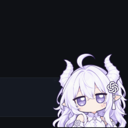

# GPT娘桌宠

DSH Web 界面右下角的一只桌宠。点她会冒出各种 GPT / ChatGPT 味的碎碎念。

这是二创：原项目是 [MeteorNOX/DeepSeek-Balance-Whale-Widget](https://github.com/MeteorNOX/DeepSeek-Balance-Whale-Widget) 的小鲸鱼挂件，
我把角色和身份换成了 **GPT / ChatGPT 拟人「GPT娘」**，功能照旧。

> **和其它桌宠并行运行**：本插件的路由前缀 `/dsh-gptniang/`、bundle id `gptniang-widget`、
> DOM class `dshgnv-*` / 全局变量 `dshgn*`、以及用户数据文件 `.dshgn-*.json`，都与上游
> `dsh-whale-widget`（`/dsh-whale/`）和 `dsh-xiaoke-widget`（`/dsh-xiaoke/`）**完全隔离**，
> 三只可以同时装在一台机器上各挂一只，互不抢路由、互不覆盖样式。两道机械保证：
> 构建期 `assertIsolation`（产物里一个上游标识符都不剩）、运行期 `tools/verify-coexist.mjs`
> （把三只插件挂到同一个 mock 宿主上，断言 69 条路由零重复注册、各守各的前缀）。

> 有一处**刻意共享**：读环境变量时 `DSHW_ADMIN_HOSTS` / `DSHW_TRUSTED_HOSTS` 与上游同名（这两个名字是
> 大写，不参与大小写敏感的重命名）。因为它们回答的是同一个问题——「哪些 Host 算可信 / 可管理」，
> 属于整个 DSH Web 的信任模型，运维配一次就该三只桌宠同时生效；若给本插件单开 `DSHGN_*`，
> 已经在用小鲸鱼的机器上这里会静默退回更严的默认值，像是配置丢了。这不是碰撞：两个插件各读各的，
> 没有「后写覆盖」语义。

> ✅ **角色图已就位**（`assets/gptniang1.png`，610×610 透明底，由项目发起人提供）。替换方式见
> [`PROVENANCE.md`](PROVENANCE.md)：`python tools/set-character-image.py <新图路径>`。


挂件实拍（`npm run preview` 起本地预览页截的，角色即上面那张图）：



## 能看什么

余额、今日已用、峰谷定价、每轮消耗。泡泡内容全部可以自己排——显示什么、多大字、什么颜色、点一下冒出哪句，都在设置里改。

## 和原版的区别

- 小鲸鱼 → **GPT娘**
- 48 条鲸鱼味台词 → **58 条 GPT 味台词**（改写 9 条身份句 + 新增 10 条招牌梗）
- **配色与皮肤保持不变**（沿用上游 DeepSeek 靛蓝）—— 挂件显示的本来就是 DSH 的 DeepSeek 账户余额，靛蓝与语义一致。想换成 OpenAI 青绿（`#10a37f` 系）：在 `skin/gptniang-theme.mjs` 里填 `HEX_TEXT` / `HEX_FILL` / `RGBA_MAP` 后重新构建。

台词大概长这样：

> As an AI language model, I cannot...
> 抱歉，我不能帮你做这个。
> 你的 20 美元到账了，我可以开始思考了。
> AGI 明年就到，这次是真的。
> Thinking...
> ChatGPT is at capacity right now. (?

剩下的自己点出来看，全清单见 [`COPY-INVENTORY.md`](COPY-INVENTORY.md)。

## 安装

先 clone，再把 clone 下来的目录 link 进 desktop profile：

```bash
git clone https://github.com/xixingyingmie/dsh-gpt-niang-widget.git
cd dsh-gpt-niang-widget
dsh plugin --profile desktop add link:"$PWD"
```

**不用重启 `dsh web`** —— 桌面 profile 是热加载的，装完宿主侧立刻生效（插件的 23 条路由马上在线）。

但**已经开着的页面不会自己长出角色**：挂件的 `<script src="/dsh-gptniang/widget.js">` 是宿主在吐
index HTML 的时候注入的，那个页面是插件加载之前渲染的，里面没有这个标签，宿主也不会往已打开的页面补塞。
在 DSH 窗口按一下 **`Ctrl+R`** 刷新就行。

刷新后若仍无角色，开 F12 → Network 看有没有 `/dsh-gptniang/widget.js` 这条请求：有（200）说明注入成功、
问题在挂载条件；没有说明注入环节出了问题。

### **嫌麻烦可以丢给 dsh 或者 Claude Code 和 codex 让他们装**

## 开发

产物 `lib/gptniang-index.js` / `lib/gptniang-widget.js` 是**构建生成**的，别手改：

```bash
npm run build     # 从 upstream/ + skin/gptniang-theme.mjs 重新生成两份产物
npm run check     # 断言产物是最新的 + 台词池无身份泄漏 + 全产物无上游标识符残留
npm run verify    # check + 语法检查 + mock 宿主路由校验 + headless 执行校验 + 三只桌宠共存校验
npm run copy      # 重新生成 COPY-INVENTORY.md
npm run preview   # 起本地预览页（真实宿主插件 + 假聊天页），不装也能看效果
```

要改命名空间 / 台词 / 配色：只改 [`skin/gptniang-theme.mjs`](skin/gptniang-theme.mjs)，然后 `npm run build`。

### 换角色图

拿到 GPT娘 的图之后，一条命令装进去（自动裁成 1:1、缩到 610×610、剥掉全部元数据、旧图自动备份）：

```bash
python tools/set-character-image.py <新图路径>
python tools/set-character-image.py          # 不带参数 = 只体检当前图，不改文件
```

不需要重新构建 —— 产物读的就是 `assets/gptniang1.png` 这个文件名。

## 目录

| 路径 | 说明 |
|---|---|
| `upstream/` | **原封不动**的上游源码（`lib/index.js`、`assets/whale-widget.js`、上游 README / PROVENANCE） |
| `skin/gptniang-theme.mjs` | 唯一事实来源：命名空间改名表、颜色表、台词改写/追加减 |
| `tools/build-gptniang.mjs` | 生成器（纯文本变换 + 三重断言） |
| `lib/gptniang-index.js`、`lib/gptniang-widget.js` | 生成产物（已提交，link: 安装可直接用） |
| `lib/accounting.mjs` | 宿主记账模块，与上游**字节相同**（零角色引用，可跨桌宠共享） |
| `assets/` | 角色图 + 音效 + 泡泡图 |
| `docs/preview.png` | 挂件截图（README 用） |
| `docs/sanxiaozhi.png` | 三只桌宠同台合影（README 结尾用） |
| `tools/preview-widget.mjs` | 本地预览页：把真实宿主插件挂到 mock ctx 上、派发真实路由，看效果不必装 |
| `tools/verify-coexist.mjs` | **共存回归**：把小鲸鱼 / 小克 / GPT娘三只同时挂到一个 mock 宿主上，断言 69 条路由零重复、各守各的前缀、三份 widget 脚本都注入成功 |

## 致谢

记账、峰谷计价、多厂商余额查询、泡泡系统这些底子全是原项目的功劳，我只换了角色和身份台词。
原项目作者 **MeteorNOX**。

许可分两块：**代码**（`lib/`、`skin/`、`tools/`、文档）按 **MIT**，见 [LICENSE](LICENSE)；
**美术素材**（`assets/**` 的图片、动图、音效）**不在 MIT 覆盖范围内**，按 as-is 随包分发、不授予再许可
（其中 `gptniang1.png` 由本项目发起人提供，其余继承自上游）。详见 [`PROVENANCE.md`](PROVENANCE.md)
与上游的 [`upstream/PROVENANCE.upstream.md`](upstream/PROVENANCE.upstream.md)。

骗你的，只是作者想看仨吃白饭的同台而已，这三小只真可爱吧

